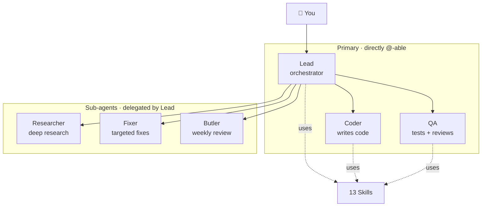

# opencrew

> Your AI crew on top of [OpenCode](https://opencode.ai). 6 agents + 13 skills — one install away from a fully operational local AI team.

English · [中文](./README.zh.md)

**TLDR**: OpenCode gives you a coding agent. opencrew gives you a whole team — lead, coder, qa, researcher, fixer, butler — plus 13 skills for everything from debugging to meeting notes to health tracking. One command:

```bash
curl -fsSL https://raw.githubusercontent.com/brikerman/opencrew/main/install.sh | bash -s -- --global --full
```

---

## What is it

**The problem.** OpenCode is powerful, but out of the box it gives you build + plan agents and little else. To get real work done you need to hand-configure agents, write prompts from scratch, figure out delegation patterns, and wire up tool integrations. That's a high bar — especially for non-developers who just want an AI team that works.

**The solution.** opencrew is a batteries-included configuration for OpenCode. One install gives you 6 agents with clear roles and 13 skills covering 90% of business + daily scenarios. From coding to research to meeting notes to health tracking — all running locally, all transparent, all in your working directory.

- **6 agents** with clear roles: a `lead` who delegates, a `coder`, a `qa`, a `researcher`, a `fixer`, a `butler`.
- **13 skills** for the work outside of coding: brainstorming, verification, troubleshooting, user-perspective review, project management, meetings, health, journaling, wellness, communication.
- **Everything lands in your working directory** — no `/tmp/` writes, no hidden dirs, fully visible in Finder.
- **Built for OpenCode** — installs as agents + skills + a project (or global) `opencode.json`.

---

## Design philosophy

**OpenCode out of the box, for everyone.** opencrew makes OpenCode accessible to non-power-users. One install, you have a working AI team — no prompt engineering needed.

**90% of business + daily scenarios covered.** Paired with [skilless](https://github.com/brikerman/skilless), it handles coding, research, writing, meetings, health, communication, and everything in between.

**Run your own local agents.** No cloud, no API keys (optional), no subscription. Your agents, your data, your machine.

**Lead is a leader, not an engineer.** It orchestrates everything; it doesn't write code. Its failure mode is "trying to do work itself".

**6 agents, not 60.** Same-permission roles share a skill, reducing cognitive load.

**Skills are different hats on the same person.** PM mode, writing mode, health-coach mode—Lead wears different hats, no need to spawn new agents.

**Built for non-technical users too.** Of the 13 skills, only a few are programmer-flavored. The rest (meeting / health / journal / communication / wellness etc.) are useful for solo founders, freelancers, knowledge workers.

**Everything is in front of you.** Nothing sneaks into `/tmp/` or hidden dirs. The AI's working process is fully transparent.

---

## Architecture



**Why only 6 agents**: the only reason an agent exists separately is a different operational boundary. OpenCode permissions are coarse today, so subagent write scopes are enforced by prompt contract unless your local OpenCode version supports stricter ACLs.

| Agent | Mode | Scope | Role |
|---|---|---|---|
| **Lead** | primary | full + delegate | Your chief of staff. Understand intent → delegate → quality control. Also handles life/health/scheduling |
| **Coder** | primary | full + delegate | Writes code, fixes bugs, refactors, builds UI |
| **QA** | primary | full + delegate | Tests, code review, doc review |
| **Researcher** | subagent | scoped write by prompt: `./research/`, `./working/research/` | Deep research, comparative analysis |
| **Fixer** | subagent | scoped write by prompt: listed files, `./working/fixer/`, `./reviews/` | Targeted fixes only, no scope creep |
| **Butler** | subagent | scoped write by prompt: `./reports/`, `./working/butler-*` | Weekly review, working-dir cleanup suggestions, skill optimization proposals |

---

## 13 Skills

A skill is a loadable instruction set, not a separate agent. The `bm.*` prefix is a namespace to avoid collisions with other skill collections.

### Methodology (3) — high-frequency

| Skill | Purpose |
|---|---|
| `bm.brainstorming` | Sharpen fuzzy intent via Socratic questioning before acting; show spec in chunks for user approval |
| `bm.verification` | Before claiming "done": run a checklist, execute it, present evidence |
| `bm.systematic-troubleshooting` | 4-stage root-cause method (reproduce → isolate → hypothesize → verify) |

### Product / Tools / Meta (4)

| Skill | Purpose |
|---|---|
| `bm.voice-of-user` | Cross-examine product/spec/feature from user perspective; play personas, list friction points |
| `bm.research` | Research methodology (search strategy, comparison framework, report format) |
| `bm.review-checklist` | 6-dimension review checklist (works for code and docs) |
| `bm.skill-improvement` | Self-improvement (used by butler—analyzes usage patterns, generates suggestions) |

### Management (2)

| Skill | Purpose |
|---|---|
| `bm.project-mgmt` | Project tracking, weekly reports, risk alerts, task breakdown |
| `bm.meeting` | Meeting minutes, transcript extraction, Action Item tracking |

### Life (4)

| Skill | Purpose |
|---|---|
| `bm.health` | Health management (metrics, diet/exercise log, trend analysis) |
| `bm.life-journal` | Life journaling (daily, weekly review, growth tracking) |
| `bm.wellness` | Wellness (symptom check, medication, mood, mental self-help) |
| `bm.communication` | Communication (NVC framework, conversation prep, role-play) |

---

## Agent ↔ Skill Matrix

| Agent | Primary skills |
|---|---|
| **Lead** | bm.brainstorming, bm.verification, bm.voice-of-user, bm.project-mgmt, bm.meeting, bm.life-journal, bm.health, bm.wellness, bm.communication |
| **Coder** | bm.systematic-troubleshooting, bm.verification, bm.review-checklist |
| **QA** | bm.review-checklist, bm.voice-of-user, bm.verification, bm.systematic-troubleshooting |
| **Researcher** | `skilless.ai-research` (preferred) / bm.research (fallback) |
| **Fixer** | bm.systematic-troubleshooting, bm.verification |
| **Butler** | bm.skill-improvement, bm.verification |

---

## File layout (every agent obeys)

```
<dir-where-you-launched-opencode>/
├── scripts/      ← scripts (one-off / reusable)
├── working/      ← intermediate artifacts (drafts, transcripts, caches, debug)
├── output/       ← final artifacts (or write to root, follow your habits)
└── ...           ← your project itself
```

- ✅ Everything in cwd, visible in Finder, no `.tmp/` style hidden dirs
- ✅ Never writes to `/tmp/`, `~/Desktop/`, `~/Downloads/`—no permission-prompt fatigue
- ✅ `working/` makes it obvious what's intermediate and safe to clean

---

## Install

### One-liner (curl | bash)

```bash
# Project-level (current dir, recommended)
curl -fsSL https://raw.githubusercontent.com/brikerman/opencrew/main/install.sh | bash

# Global (any directory)
curl -fsSL https://raw.githubusercontent.com/brikerman/opencrew/main/install.sh | bash -s -- --global

# Global + disable built-in webfetch/websearch (force skilless)
curl -fsSL https://raw.githubusercontent.com/brikerman/opencrew/main/install.sh | bash -s -- --global --full
```

The installer clones the repo to `~/.cache/opencrew/repo` and re-executes from there. Requires `git` for one-liner installs and `jq` for config merge (`brew install jq` on macOS). Re-running the one-liner updates the cached clone.

### From a clone

```bash
git clone https://github.com/brikerman/opencrew.git
cd opencrew
./install.sh                  # default: install into current project
./install.sh --global         # or globally: available in any directory
```

### Project-level (default)

Writes to current cwd:

- agents → `./.opencode/agent/*.md`
- config → `./opencode.json` (registers agents + `default_agent: lead`)
- skills → `~/.agents/skills/bm.*/SKILL.md` (always shared globally, loaded by name)

Only effective in this project. Other projects unaffected. **Recommended** to keep each project isolated.

### Global

```bash
./install.sh --global
```

Writes to:

- agents → `~/.config/opencode/agents/*.md`
- config → `~/.config/opencode/opencode.json`
- skills → `~/.agents/skills/bm.*/SKILL.md`

Any directory you launch opencode in works.

### `--full` mode

```bash
./install.sh --full           # project + disable webfetch/websearch
./install.sh --global --full  # global + disable webfetch/websearch
```

Adds `webfetch: deny` + `websearch: deny` into the opencode.json top-level `permission`, forcing the [skilless](https://github.com/brikerman/skilless) tool chain.

### Other commands

```bash
./install.sh --check      # check current scope's install status
./install.sh --rollback   # roll back the last install
./install.sh --force      # overwrite managed files and refresh managed config entries
./install.sh --help
```

The installer detects [skilless](https://github.com/brikerman/skilless); if missing it prints the install command (does not auto-install). No workspace template is deployed outside your project; skills are always installed globally under `~/.agents/skills/`, and one-liner installs use `~/.cache/opencrew/`.

### Recommended companion (optional)

[skilless](https://github.com/brikerman/skilless) provides search / web / yt-dlp / ffmpeg CLI tools. Researcher prefers it, and `--full` mode expects it:

```bash
curl -fsSL https://skilless.ai/install.sh | bash
```

---

## Typical scenarios

```
You → Lead: "Add JWT auth to the user module"
Lead → Coder: implement
Lead → QA: review
Lead → Fixer: fix issues (if any)
On completion Lead invokes bm.verification for a verified completion report
```

```
You → Lead: "Compare Zustand and Jotai"
Lead → Researcher (background, using skilless.ai-research)
Researcher → report written to ./research/zustand-vs-jotai/REPORT.md
```

```
You → Lead: "Review this product spec"
Lead invokes bm.voice-of-user, plays 3 personas through the flow
Output → ./reviews/{topic}-uxreview.md
```

```
You → Lead: "Process this meeting transcript"
Lead invokes bm.meeting → writes ./meetings/2026-05-21-weekly.md
```

```
You → Lead: "Logged today's weight 72.5kg, ran 5km"
Lead invokes bm.health → confirms saving, then writes ./health/body/metrics/2026-05-21.md and ./health/exercise/2026-05-21.md
```

```
You → Lead: "Do a sweep of my working directory"
Lead → Butler (background)
Butler scans cwd → writes ./reports/butler-2026-05-21.md
```

---

## Repo structure

```
opencrew/
├── opencode.json        # reference/dev config; installer generates project paths
├── agents/              # 6 agent prompts
│   ├── lead.md
│   ├── coder.md
│   ├── qa.md
│   ├── researcher.md
│   ├── fixer.md
│   └── butler.md
├── skills/              # 13 skills
│   ├── bm.brainstorming/SKILL.md
│   ├── bm.verification/SKILL.md
│   ├── bm.systematic-troubleshooting/SKILL.md
│   ├── bm.voice-of-user/SKILL.md
│   ├── bm.research/SKILL.md
│   ├── bm.review-checklist/SKILL.md
│   ├── bm.skill-improvement/SKILL.md
│   ├── bm.project-mgmt/SKILL.md
│   ├── bm.meeting/SKILL.md
│   ├── bm.health/SKILL.md
│   ├── bm.life-journal/SKILL.md
│   ├── bm.wellness/SKILL.md
│   └── bm.communication/SKILL.md
├── install.sh           # global installer
└── README.md / README.zh.md
```

---

## Uninstall

```bash
./install.sh --rollback
```

Restores the original opencode.json and removes the agent / skill files we added.

---

## License

MIT
