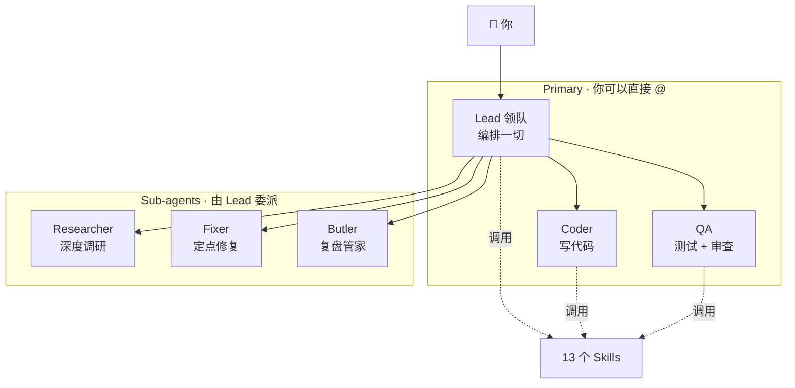

# opencrew

> 跑在 [OpenCode](https://opencode.ai) 上的 AI 团队。6 个 agent + 13 个 skill，一条命令开箱即用。

[English](./README.md) · 中文

**TLDR**: OpenCode 给你一个编码 agent，opencrew 给你一整个团队——lead、coder、qa、researcher、fixer、butler——加上 13 个 skill 覆盖从 debug 到会议纪要到健康追踪的一切。一条命令搞定：

```bash
curl -fsSL https://raw.githubusercontent.com/brikerman/opencrew/main/install.sh | bash -s -- --global --full
```

---

## 这是什么

**问题。** OpenCode 很强大，但开箱只有 build + plan agent。要真正干活，你得手动配置 agent、从零写 prompt、搞清楚委派模式、接入工具链——门槛很高，尤其是非开发者，只想有个能用的 AI 团队。

**解法。** opencrew 是 OpenCode 的开箱即用配置。一次安装，6 个角色清晰的 agent + 13 个 skill 覆盖 90% 的商业 + 日常场景。从编码到调研到会议纪要到健康追踪——全部本地运行，全部透明，全部在你的工作目录里。

- **6 个角色清晰的 agent**：`lead` 编排委派、`coder` 写代码、`qa` 测试审查、`researcher` 深度调研、`fixer` 定点修复、`butler` 复盘管家。
- **13 个 skill** 覆盖编码之外的事：brainstorming、verification、systematic-troubleshooting、用户视角评审、项目管理、会议、健康、日记、身心健康、沟通。
- **所有产物落在你的工作目录**，不写 `/tmp/`、不用隐藏目录，Finder 能看见。
- **为 OpenCode 设计**：安装时注入 agent + skill + 项目级（或全局）的 `opencode.json`。

---

## 设计理念

**开箱即用，面向所有人。** opencrew 让非高级用户也能直接用 OpenCode。一次安装，就有一个可用的 AI 团队——不需要 prompt 工程。

**覆盖 90% 的商业 + 日常场景。** 搭配 [skilless](https://github.com/brikerman/skilless)，编码、调研、写作、会议、健康、沟通全都能搞定。

**跑你自己的本地 agent。** 不用云、不用 API key（可选）、不用订阅。你的 agent、你的数据、你的机器。

**Lead = 领队，不是工程师。** 它编排一切，不写代码。它的失败模式是「试图自己干活」。

**6 agents 不是 60 个。** 权限相同的角色用 skill，避免认知负担。

**skill 是同一个人的不同帽子。** PM 模式、写作模式、健康教练模式都是 Lead 戴不同的帽子，不需要造新 agent。

**面向非技术用户。** 13 个 skill 里只有少数是程序员视角的，大部分（meeting / health / journal / communication / wellness 等）一个人公司、自由职业、知识工作者都用得上。

**所有产物都在你眼前。** 不偷偷写 `/tmp/`、不用隐藏目录，让 AI 的工作过程对你完全透明。

---

## 架构



**为什么只有 6 个 agent**：每个 agent 独立存在的唯一理由是不同的工作边界。OpenCode 当前权限较粗，所以 subagent 的写入范围主要靠 prompt 契约约束；如果你的 OpenCode 版本支持更细 ACL，再进一步收紧。

| Agent | 模式 | 范围 | 职责 |
|---|---|---|---|
| **Lead** | primary | 全 + 委派 | 你的 chief of staff。理解意图 → 委派 → 质控 → 也管生活 |
| **Coder** | primary | 全 + 委派 | 写代码、修 bug、重构、UI |
| **QA** | primary | 全 + 委派 | 测试、代码审查、文档审查 |
| **Researcher** | subagent | prompt 约束：只写 `./research/`、`./working/research/`（代码项目 → `./docs/research/`） | 深度调研、对比分析 |
| **Fixer** | subagent | prompt 约束：只写清单文件、`./working/fixer/`、`./reviews/`（代码项目 → `./docs/reviews/`） | 定点修复，不顺手优化 |
| **Butler** | subagent | prompt 约束：只写 `./reports/`、`./working/butler-*`（代码项目 → `./docs/reports/`） | 复盘工作目录、提出 skill 优化建议 |

---

## 13 个 Skills

Skill 是可加载的指令集，不是独立 agent。用 `bm.*` 前缀做命名空间隔离，避免与其他 skill 集合冲突。

### 方法论 (3) — 高频调用

| Skill | 作用 |
|---|---|
| `bm.brainstorming` | 行动前用苏格拉底式追问精炼意图，分块展现 spec 让用户确认 |
| `bm.verification` | 声明"完成"前必须列检查清单、跑一遍、给证据 |
| `bm.systematic-troubleshooting` | 4 阶段根因法（复现 → 缩小 → 假设 → 验证） |

### 产品 / 工具 / 元 (4)

| Skill | 作用 |
|---|---|
| `bm.voice-of-user` | 从用户视角拷问产品/spec/feature，扮演 persona 列摩擦点 |
| `bm.research` | 调研方法论（搜索策略、对比框架、报告格式） |
| `bm.review-checklist` | 审查清单（6 维度，代码和文档通用） |
| `bm.skill-improvement` | 自我优化（butler 用，分析使用模式 → 生成建议） |

### 管理 (2)

| Skill | 作用 |
|---|---|
| `bm.project-mgmt` | 项目跟踪、周报、风险预警、任务分解 |
| `bm.meeting` | 会议纪要、字幕提取、Action Items 跟踪 |

### 生活 (4)

| Skill | 作用 |
|---|---|
| `bm.health` | 健康管理（指标追踪、饮食运动记录、趋势分析） |
| `bm.life-journal` | 生活记录（日记、周报回顾、成长追踪） |
| `bm.wellness` | 身心健康（症状评估、用药、情绪、心理自助） |
| `bm.communication` | 沟通达人（NVC 框架、对话准备、角色扮演） |

---

## Agent ↔ Skill 矩阵

| Agent | 主要 Skills |
|---|---|
| **Lead** | bm.brainstorming, bm.verification, bm.voice-of-user, bm.project-mgmt, bm.meeting, bm.life-journal, bm.health, bm.wellness, bm.communication |
| **Coder** | bm.systematic-troubleshooting, bm.verification, bm.review-checklist |
| **QA** | bm.review-checklist, bm.voice-of-user, bm.verification, bm.systematic-troubleshooting |
| **Researcher** | `skilless.ai-research`（首选）/ bm.research（备用） |
| **Fixer** | bm.systematic-troubleshooting, bm.verification |
| **Butler** | bm.skill-improvement, bm.verification |

---

## 文件落点（所有 agent 遵守）

**非代码项目**（笔记、Obsidian vault 等）：

```
你启动 opencode 的目录/
├── scripts/      ← 脚本（一次性 / 可复用）
├── working/      ← 中间产物（草稿、转写、缓存、调试）
├── output/       ← 最终产物（也可直接写到根，跟随你的惯例）
└── ...           ← 你的项目本身
```

**代码项目**（检测标志：`package.json`、`Cargo.toml`、`go.mod`、`pyproject.toml` 等）：

```
你启动 opencode 的目录/
├── scripts/      ← 脚本（一次性 / 可复用）
├── working/      ← 中间产物（不变）
├── docs/         ← 所有文档类产物
│   ├── research/
│   ├── reviews/
│   ├── reports/
│   └── ...
└── ...           ← 你的代码项目
```

- ✅ 所有产物都在当前目录，Finder 能看见，不用 `.tmp/` 隐藏目录
- ✅ 不会往 `/tmp/`、`~/Desktop/`、`~/Downloads/` 写东西，避免每次问你授权
- ✅ `working/` 让你一眼知道哪些是中间产物，可以放心清理
- ✅ 代码项目：文档类产物统一放 `./docs/`，保持项目根目录整洁

---

## 安装

### 一行命令（curl | bash）

```bash
# 项目级（当前目录，推荐）
curl -fsSL https://raw.githubusercontent.com/brikerman/opencrew/main/install.sh | bash

# 全局（所有目录）
curl -fsSL https://raw.githubusercontent.com/brikerman/opencrew/main/install.sh | bash -s -- --global

# 全局 + 关闭 webfetch/websearch（强制走 skilless）
curl -fsSL https://raw.githubusercontent.com/brikerman/opencrew/main/install.sh | bash -s -- --global --full
```

安装器会自动 clone 仓库到 `~/.cache/opencrew/repo` 再 re-exec。一行安装需要 `git`，配置合并需要 `jq`（macOS 可用 `brew install jq`）。重跑同样命令会更新缓存里的 clone。

### 从 clone 安装

```bash
git clone https://github.com/brikerman/opencrew.git
cd opencrew
./install.sh                  # 默认：装到当前项目
./install.sh --global         # 或者全局：所有项目都可用
```

### 项目级（默认）

写到当前 cwd（即你 `cd` 进的目录）：

- agents → `./.opencode/agent/*.md`
- 配置 → `./opencode.json`（注册 agents + `default_agent: lead`）
- skills → `~/.agents/skills/bm.*/SKILL.md` ← 始终全局共享，按名加载

只对你 `cd` 进的这个项目生效。其他项目不受影响。**推荐**：每个项目独立配置，避免污染全局。

### 全局

```bash
./install.sh --global
```

写到：

- agents → `~/.config/opencode/agents/*.md`
- 配置 → `~/.config/opencode/opencode.json`
- skills → `~/.agents/skills/bm.*/SKILL.md`

任何目录启动 opencode 都能用。

### `--full` 模式

```bash
./install.sh --full           # 项目级 + 关 webfetch/websearch
./install.sh --global --full  # 全局 + 关 webfetch/websearch
```

额外在 opencode.json 顶层 `permission` 写入 `webfetch: deny` + `websearch: deny`，强制走 [skilless](https://github.com/brikerman/skilless) 工具链。

### 其他命令

```bash
./install.sh --check      # 检查当前 scope 安装状态
./install.sh --rollback   # 回滚最近一次安装
./install.sh --force      # 强制覆盖托管文件，并刷新托管 config 条目
./install.sh --help
```

安装时会检测 [skilless](https://github.com/brikerman/skilless)，没装会提示安装命令（不会自动装）。不会在项目外部署 workspace 模板；但 skills 始终安装到 `~/.agents/skills/` 全局共享，一行安装会使用 `~/.cache/opencrew/`。

### 推荐配套（可选）

[skilless](https://github.com/brikerman/skilless) — 提供 search / web / yt-dlp / ffmpeg CLI 工具链，researcher 优先用它。安装：

```bash
curl -fsSL https://skilless.ai/install.sh | bash
```

---

## 典型场景

```
你 → Lead: "给用户模块加 JWT 认证"
Lead → Coder: 实现
Lead → QA: 审查
Lead → Fixer: 修复 (如有问题)
完成时 Lead 调用 bm.verification 给完成报告
```

```
你 → Lead: "对比 Zustand 和 Jotai"
Lead → Researcher (background, 用 skilless.ai-research)
Researcher → 报告写入 ./research/zustand-vs-jotai/REPORT.md
```

```
你 → Lead: "评审一下这个产品 spec"
Lead 调用 bm.voice-of-user，扮演 3 个 persona 跑流程
输出 ./reviews/{topic}-uxreview.md
```

```
你 → Lead: "处理这个会议字幕"
Lead 调用 bm.meeting → 写入 ./meetings/2026-05-21-weekly.md
```

```
你 → Lead: "记录今天体重 72.5kg，跑了 5km"
Lead 调用 bm.health → 确认是否保存后，写入 ./health/body/metrics/2026-05-21.md 和 ./health/exercise/2026-05-21.md
```

```
你 → Lead: "复盘一下我的工作目录"
Lead → Butler (background)
Butler 扫 cwd → 写入 ./reports/butler-2026-05-21.md
```

---

## 项目结构

```
opencrew/
├── opencode.json        # 参考/开发配置；安装器会生成项目路径
├── agents/              # 6 个 agent prompt
│   ├── lead.md
│   ├── coder.md
│   ├── qa.md
│   ├── researcher.md
│   ├── fixer.md
│   └── butler.md
├── skills/              # 13 个 skill
│   ├── bm.brainstorming/SKILL.md
│   ├── bm.verification/SKILL.md
│   ├── bm.systematic-troubleshooting/SKILL.md
│   ├── bm.voice-of-user/SKILL.md
│   ├── bm.research/SKILL.md
│   ├── bm.review-checklist/SKILL.md
│   ├── bm.skill-improvement/SKILL.md
│   ├── bm.project-mgmt/SKILL.md
│   ├── bm.meeting/SKILL.md
│   ├── bm.health/SKILL.md
│   ├── bm.life-journal/SKILL.md
│   ├── bm.wellness/SKILL.md
│   └── bm.communication/SKILL.md
├── install.sh           # 全局安装脚本
└── README.md / README.zh.md
```

---

## 卸载

```bash
./install.sh --rollback
```

回滚到安装前状态：恢复原 opencode.json、删除我们加的 agent / skill 文件。

---

## License

MIT
